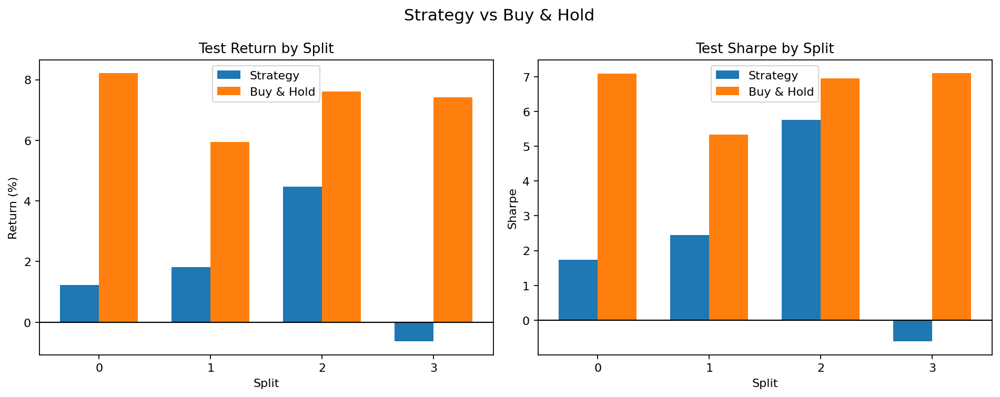
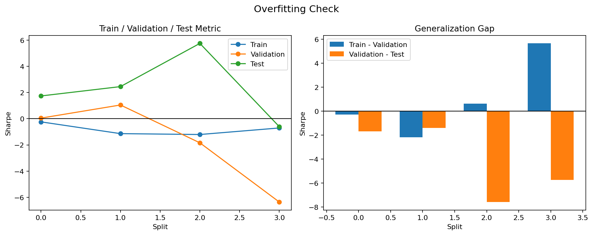

# 루프 요약

- 총 반복 횟수: 12
- 종료 이유: 최대 반복 횟수에 도달해서 종료했습니다.
- 최고 iteration: 0
- 최고 실행 폴더: examples/agent_loop_runs/BTC-USD_20260412_152029/runs/BTC-USD_20260412_152029
- 최고 판정: 실패
- Iteration 0: 실패, 중앙값 2.095, 플러스 비율 75.0%, 홀드 초과 비율 0.0%
  자세히 보기: [0회차 요약](runs/BTC-USD_20260412_152029/summary_ko.md)
- Iteration 1: 실패, 중앙값 0.485, 플러스 비율 75.0%, 홀드 초과 비율 0.0%
  자세히 보기: [1회차 요약](runs/BTC-USD_20260412_152034/summary_ko.md)
- Iteration 2: 실패, 중앙값 -0.017, 플러스 비율 0.0%, 홀드 초과 비율 0.0%
  자세히 보기: [2회차 요약](runs/BTC-USD_20260412_152035/summary_ko.md)
- Iteration 3: 실패, 중앙값 0.022, 플러스 비율 50.0%, 홀드 초과 비율 0.0%
  자세히 보기: [3회차 요약](runs/BTC-USD_20260412_152036/summary_ko.md)
- Iteration 4: 실패, 중앙값 1.354, 플러스 비율 75.0%, 홀드 초과 비율 0.0%
  자세히 보기: [4회차 요약](runs/BTC-USD_20260412_152037/summary_ko.md)
- Iteration 5: 실패, 중앙값 0.015, 플러스 비율 75.0%, 홀드 초과 비율 0.0%
  자세히 보기: [5회차 요약](runs/BTC-USD_20260412_152037/summary_ko.md)
- Iteration 6: 실패, 중앙값 0.003, 플러스 비율 75.0%, 홀드 초과 비율 0.0%
  자세히 보기: [6회차 요약](runs/BTC-USD_20260412_152038/summary_ko.md)
- Iteration 7: 실패, 중앙값 0.011, 플러스 비율 75.0%, 홀드 초과 비율 0.0%
  자세히 보기: [7회차 요약](runs/BTC-USD_20260412_152039/summary_ko.md)
- Iteration 8: 실패, 중앙값 0.017, 플러스 비율 75.0%, 홀드 초과 비율 0.0%
  자세히 보기: [8회차 요약](runs/BTC-USD_20260412_152040/summary_ko.md)
- Iteration 9: 실패, 중앙값 0.002, 플러스 비율 75.0%, 홀드 초과 비율 0.0%
  자세히 보기: [9회차 요약](runs/BTC-USD_20260412_152041/summary_ko.md)
- Iteration 10: 실패, 중앙값 0.002, 플러스 비율 75.0%, 홀드 초과 비율 0.0%
  자세히 보기: [10회차 요약](runs/BTC-USD_20260412_152042/summary_ko.md)
- Iteration 11: 실패, 중앙값 -0.002, 플러스 비율 50.0%, 홀드 초과 비율 0.0%
  자세히 보기: [11회차 요약](runs/BTC-USD_20260412_152043/summary_ko.md)

## 최고 iteration 시각화

### 홀드 비교

### 오버피팅 점검

