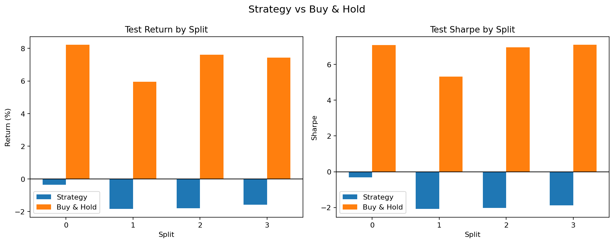
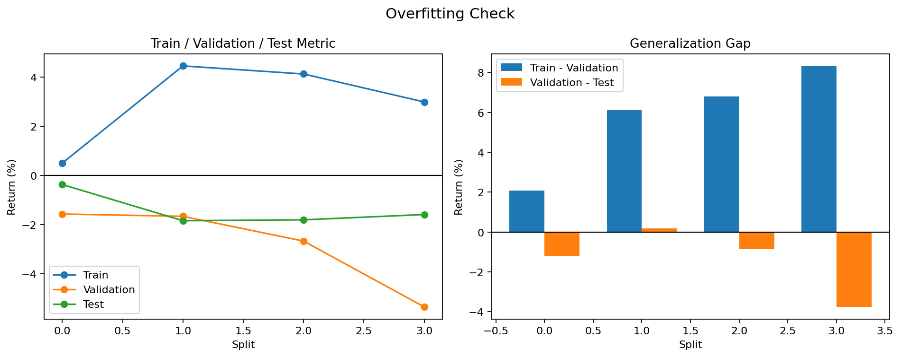

# Iteration 2 요약

- 판정: 실패
- 실행 폴더: examples/agent_loop_runs/BTC-USD_20260412_152029/runs/BTC-USD_20260412_152035
- 데이터 설정: BTC-USD, 5m, 기간 60d
- 구간 설정: train 35일 / validation 10일 / test 10일, split 4개
- 전략 설정: MA crossover, window `24:193:24`, 선택 기준 `총수익률`, 후보 6개, 최소 거래 1회
- 변경 설명: MA 탐색 구간을 `24,48,72,96,120,144,168,192,216`에서 `24:193:24`로 바꿨습니다.
- 변경 설명: 검증 선택 기준을 `샤프 비율`에서 `총수익률`로 바꿨습니다.
- 변경 설명: train 상위 후보 수를 8개에서 6개로 조정했습니다.
- 핵심 지표: 테스트 중앙값 -0.017, 플러스 비율 0.0%, 홀드 초과 비율 0.0%
- 보조 지표: 평균 테스트 수익률 -1.40%, 평균 테스트 낙폭 5.91%
- 선택된 파라미터: [[48, 192], [24, 168], [144, 192]]
- 실패/판정 이유: 테스트 총수익률 중앙값이 -0.017로 기준 0.000보다 낮았습니다.
- 실패/판정 이유: 플러스 테스트 비율이 0.0%로 기준 50.0%보다 낮았습니다.
- 실패/판정 이유: 홀드를 이긴 비율이 0.0%로 기준 50.0%보다 낮았습니다.
- 실패/판정 이유: 평균 테스트 수익률이 -1.40%로 기준 0.00%보다 낮았습니다.
- 현재까지 최고 iteration: 0 (실패)

## 시각화

### 홀드 비교

### 오버피팅 점검

