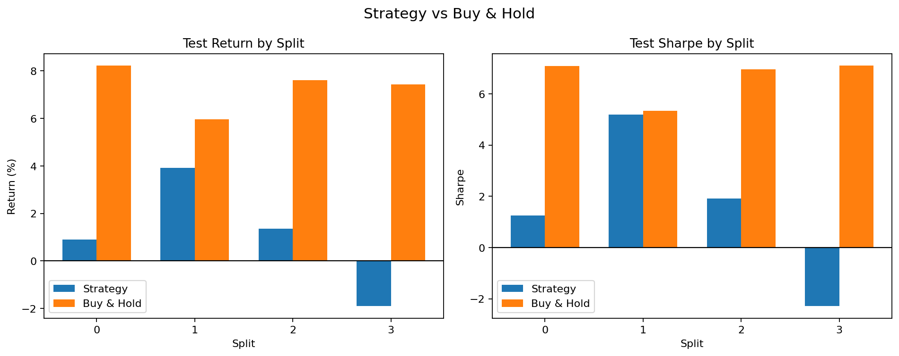
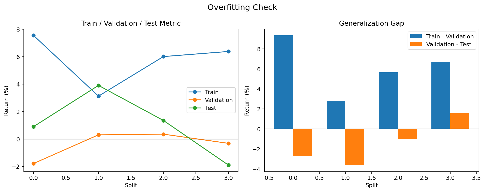

# Iteration 7 요약

- 판정: 실패
- 실행 폴더: examples/agent_loop_runs/BTC-USD_20260412_152029/runs/BTC-USD_20260412_152039
- 데이터 설정: BTC-USD, 5m, 기간 60d
- 구간 설정: train 35일 / validation 10일 / test 10일, split 4개
- 전략 설정: MA crossover, window `24,48,96,120,144,168,192,216,240`, 선택 기준 `총수익률`, 후보 8개, 최소 거래 1회
- 변경 설명: MA 탐색 구간을 `24,48,72,96,120,144,168,192,216`에서 `24,48,96,120,144,168,192,216,240`로 바꿨습니다.
- 핵심 지표: 테스트 중앙값 0.011, 플러스 비율 75.0%, 홀드 초과 비율 0.0%
- 보조 지표: 평균 테스트 수익률 1.07%, 평균 테스트 낙폭 4.31%
- 선택된 파라미터: [[24, 168], [96, 240], [168, 240]]
- 실패/판정 이유: 홀드를 이긴 비율이 0.0%로 기준 50.0%보다 낮았습니다.
- 현재까지 최고 iteration: 0 (실패)

## 시각화

### 홀드 비교

### 오버피팅 점검

