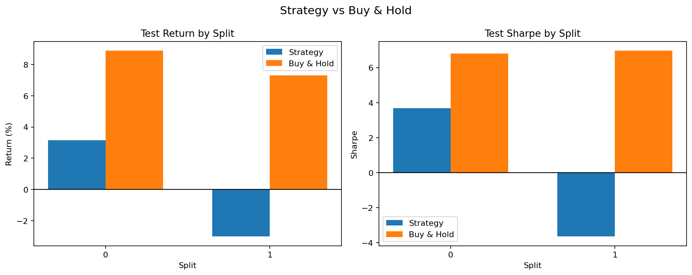
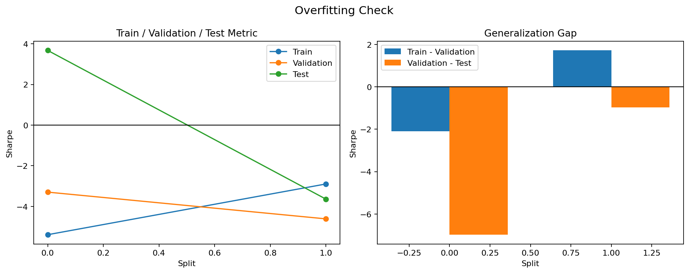

# 루프 요약

- 총 반복 횟수: 10
- 종료 이유: 최대 반복 횟수에 도달해서 종료했습니다.
- 최고 iteration: 4
- 최고 실행 폴더: examples/agent_loop_runs/BTC_USDT_20260412_155742/runs/BTC_USDT_20260412_155812
- 최고 판정: 실패
- Iteration 0: 실패, 중앙값 -0.821, 플러스 비율 50.0%, 홀드 초과 비율 0.0%
  자세히 보기: [0회차 요약](runs/BTC_USDT_20260412_155742/summary_ko.md)
- Iteration 1: 실패, 중앙값 -0.821, 플러스 비율 50.0%, 홀드 초과 비율 0.0%
  자세히 보기: [1회차 요약](runs/BTC_USDT_20260412_155752/summary_ko.md)
- Iteration 2: 실패, 중앙값 0.001, 플러스 비율 50.0%, 홀드 초과 비율 0.0%
  자세히 보기: [2회차 요약](runs/BTC_USDT_20260412_155758/summary_ko.md)
- Iteration 3: 실패, 중앙값 -0.013, 플러스 비율 50.0%, 홀드 초과 비율 0.0%
  자세히 보기: [3회차 요약](runs/BTC_USDT_20260412_155805/summary_ko.md)
- Iteration 4: 실패, 중앙값 0.017, 플러스 비율 50.0%, 홀드 초과 비율 0.0%
  자세히 보기: [4회차 요약](runs/BTC_USDT_20260412_155812/summary_ko.md)
- Iteration 5: 실패, 중앙값 -1.544, 플러스 비율 50.0%, 홀드 초과 비율 0.0%
  자세히 보기: [5회차 요약](runs/BTC_USDT_20260412_155818/summary_ko.md)
- Iteration 6: 실패, 중앙값 -0.611, 플러스 비율 50.0%, 홀드 초과 비율 0.0%
  자세히 보기: [6회차 요약](runs/BTC_USDT_20260412_155825/summary_ko.md)
- Iteration 7: 실패, 중앙값 -0.821, 플러스 비율 50.0%, 홀드 초과 비율 0.0%
  자세히 보기: [7회차 요약](runs/BTC_USDT_20260412_155832/summary_ko.md)
- Iteration 8: 실패, 중앙값 -0.611, 플러스 비율 50.0%, 홀드 초과 비율 0.0%
  자세히 보기: [8회차 요약](runs/BTC_USDT_20260412_155839/summary_ko.md)
- Iteration 9: 실패, 중앙값 -1.248, 플러스 비율 50.0%, 홀드 초과 비율 0.0%
  자세히 보기: [9회차 요약](runs/BTC_USDT_20260412_155846/summary_ko.md)

## 최고 iteration 시각화

### 홀드 비교

### 오버피팅 점검

