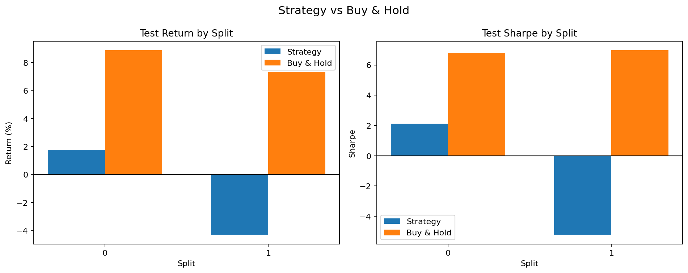
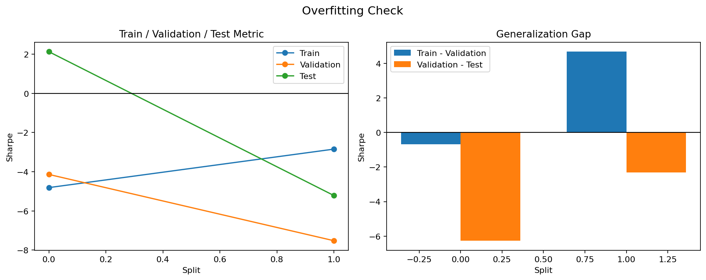

# Iteration 5 요약

- 판정: 실패
- 실행 폴더: examples/agent_loop_runs/BTC_USDT_20260412_155742/runs/BTC_USDT_20260412_155818
- 데이터 설정: CCXT, 거래소 binance, BTC/USDT, 5m, 기간 180d
- 구간 설정: train 30일 / validation 10일 / test 10일, split 2개
- 전략 설정: MA crossover, window `6,12,18,24,30,90,96,102,108`, 선택 기준 `샤프 비율`, 후보 3개, 최소 거래 1회
- 변경 설명: MA 탐색 구간을 `6,12,18,24,30,90,96,102`에서 `6,12,18,24,30,90,96,102,108`로 바꿨습니다.
- 핵심 지표: 테스트 중앙값 -1.544, 플러스 비율 50.0%, 홀드 초과 비율 0.0%
- 보조 지표: 평균 테스트 수익률 -1.27%, 평균 테스트 낙폭 6.51%
- 선택된 파라미터: [[30, 96], [18, 90]]
- 실패/판정 이유: 테스트 샤프 비율 중앙값이 -1.544로 기준 0.000보다 낮았습니다.
- 실패/판정 이유: 홀드를 이긴 비율이 0.0%로 기준 50.0%보다 낮았습니다.
- 실패/판정 이유: 평균 테스트 수익률이 -1.27%로 기준 0.00%보다 낮았습니다.
- 현재까지 최고 iteration: 4 (실패)

## 시각화

### 홀드 비교

### 오버피팅 점검

