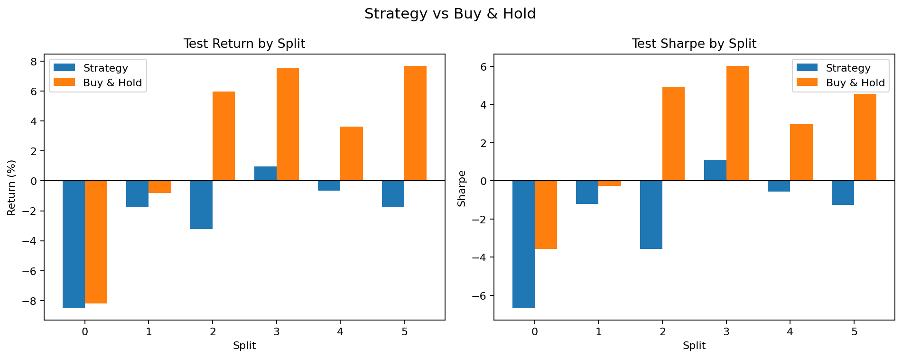
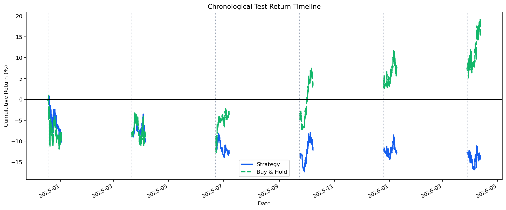
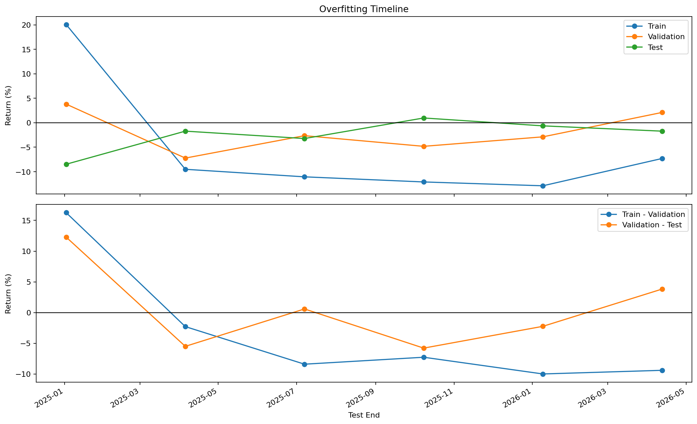

# 루프 요약

- 총 반복 횟수: 10
- 종료 이유: 최대 반복 횟수에 도달해서 종료했습니다.
- 최고 iteration: 7
- 최고 실행 폴더: examples/agent_loop_runs/BTC_USDT_20260412_160856/runs/BTC_USDT_20260412_161114
- 최고 판정: 실패
- Iteration 0: 실패, 중앙값 -2.103, 플러스 비율 16.7%, 홀드 초과 비율 0.0%
  자세히 보기: [0회차 요약](runs/BTC_USDT_20260412_160856/loop_iteration_summary_ko.md)
- Iteration 1: 실패, 중앙값 -2.169, 플러스 비율 16.7%, 홀드 초과 비율 0.0%
  자세히 보기: [1회차 요약](runs/BTC_USDT_20260412_160924/loop_iteration_summary_ko.md)
- Iteration 2: 실패, 중앙값 -0.017, 플러스 비율 16.7%, 홀드 초과 비율 0.0%
  자세히 보기: [2회차 요약](runs/BTC_USDT_20260412_160944/loop_iteration_summary_ko.md)
- Iteration 3: 실패, 중앙값 -0.024, 플러스 비율 16.7%, 홀드 초과 비율 0.0%
  자세히 보기: [3회차 요약](runs/BTC_USDT_20260412_161004/loop_iteration_summary_ko.md)
- Iteration 4: 실패, 중앙값 -2.376, 플러스 비율 16.7%, 홀드 초과 비율 0.0%
  자세히 보기: [4회차 요약](runs/BTC_USDT_20260412_161022/loop_iteration_summary_ko.md)
- Iteration 5: 실패, 중앙값 -0.024, 플러스 비율 16.7%, 홀드 초과 비율 0.0%
  자세히 보기: [5회차 요약](runs/BTC_USDT_20260412_161039/loop_iteration_summary_ko.md)
- Iteration 6: 실패, 중앙값 -0.023, 플러스 비율 16.7%, 홀드 초과 비율 0.0%
  자세히 보기: [6회차 요약](runs/BTC_USDT_20260412_161056/loop_iteration_summary_ko.md)
- Iteration 7: 실패, 중앙값 -0.017, 플러스 비율 16.7%, 홀드 초과 비율 0.0%
  자세히 보기: [7회차 요약](runs/BTC_USDT_20260412_161114/loop_iteration_summary_ko.md)
- Iteration 8: 실패, 중앙값 -0.035, 플러스 비율 16.7%, 홀드 초과 비율 0.0%
  자세히 보기: [8회차 요약](runs/BTC_USDT_20260412_161132/loop_iteration_summary_ko.md)
- Iteration 9: 실패, 중앙값 -2.376, 플러스 비율 16.7%, 홀드 초과 비율 0.0%
  자세히 보기: [9회차 요약](runs/BTC_USDT_20260412_161149/loop_iteration_summary_ko.md)

## 최고 iteration 시각화

### 홀드 비교

### 수익률 타임라인

### 오버피팅 타임라인

