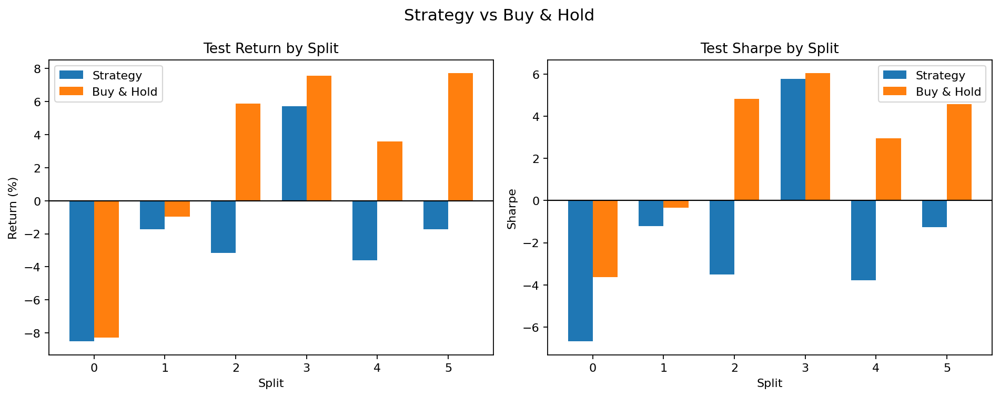
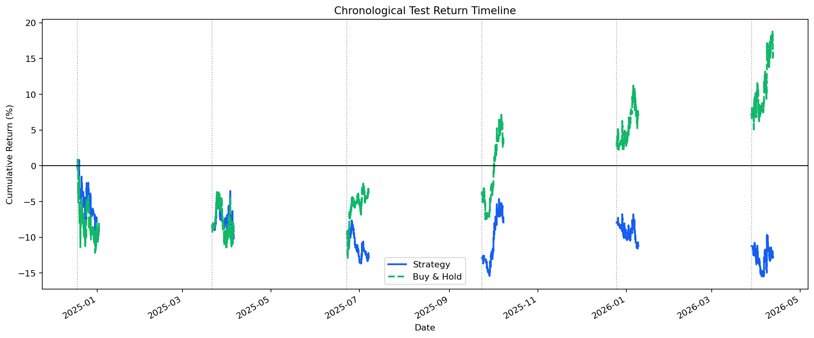
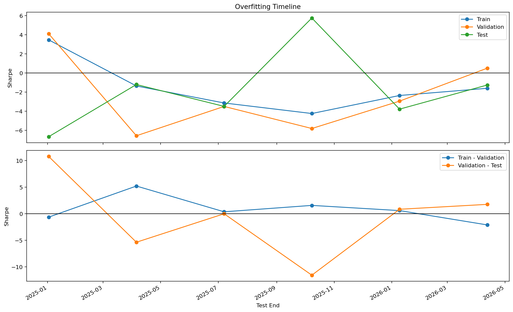

# Iteration 4 요약

- 판정: 실패
- 실행 폴더: examples/agent_loop_runs/BTC_USDT_20260412_160856/runs/BTC_USDT_20260412_161022
- 데이터 설정: CCXT, 거래소 binance, BTC/USDT, 5m, 기간 540d
- 구간 설정: train 45일 / validation 15일 / test 15일, split 6개
- 전략 설정: MA crossover, window `6,12,18,24,36,48,72,96,144`, 선택 기준 `샤프 비율`, 후보 4개, 최소 거래 1회
- 원본 백테스트 요약: [summary_ko.md](summary_ko.md)
- 변경 설명: MA 탐색 구간을 `12,18,24,30,36,42,90,96,102,138,144,150`에서 `6,12,18,24,36,48,72,96,144`로 바꿨습니다.
- 변경 설명: 검증 선택 기준을 `총수익률`에서 `샤프 비율`로 바꿨습니다.
- 변경 설명: train 상위 후보 수를 6개에서 4개로 조정했습니다.
- 핵심 지표: 테스트 중앙값 -2.376, 플러스 비율 16.7%, 홀드 초과 비율 0.0%
- 보조 지표: 평균 테스트 수익률 -2.17%, 평균 테스트 낙폭 6.42%
- 선택된 파라미터: [[96, 144], [36, 144], [18, 144], [36, 96], [48, 96]]
- 실패/판정 이유: 테스트 샤프 비율 중앙값이 -2.376로 기준 0.000보다 낮았습니다.
- 실패/판정 이유: 플러스 테스트 비율이 16.7%로 기준 50.0%보다 낮았습니다.
- 실패/판정 이유: 홀드를 이긴 비율이 0.0%로 기준 50.0%보다 낮았습니다.
- 실패/판정 이유: 평균 테스트 수익률이 -2.17%로 기준 0.00%보다 낮았습니다.
- 현재까지 최고 iteration: 2 (실패)

## 시각화

### 홀드 비교

### 수익률 타임라인

### 오버피팅 타임라인

