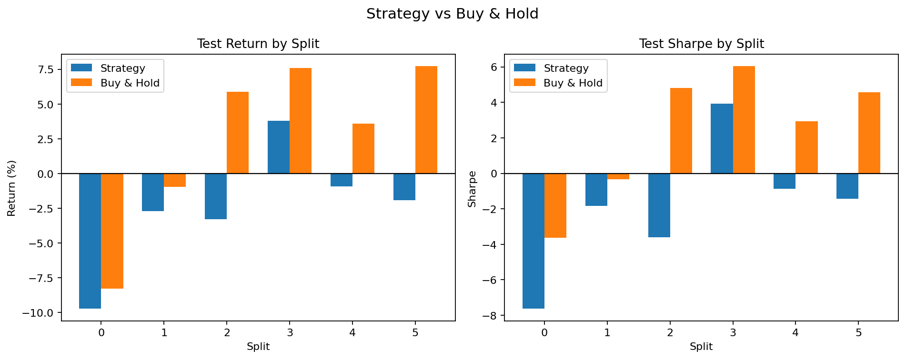
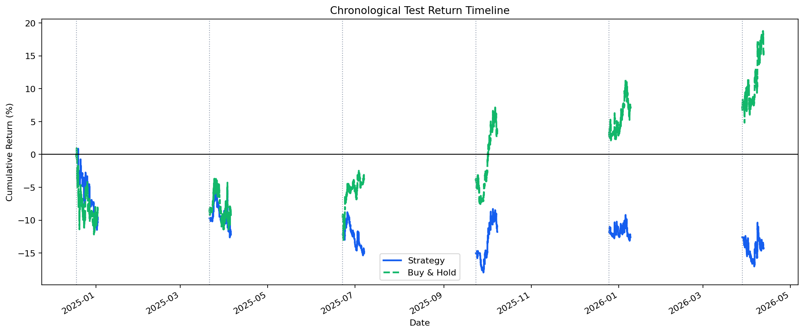
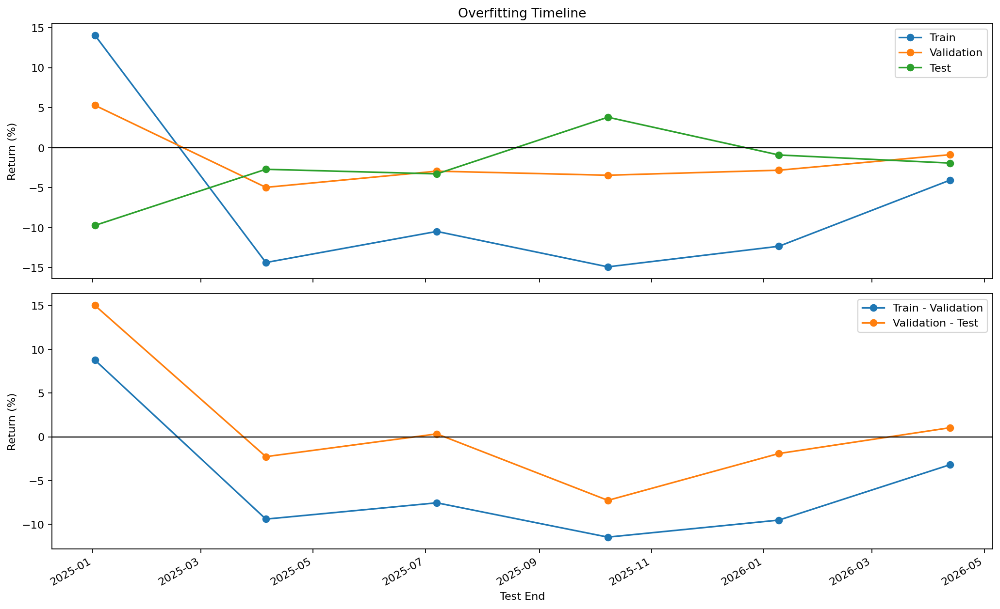

# 전략 백테스트 요약

- 판정: 실패
- 실행 폴더: examples/agent_loop_runs/BTC_USDT_20260412_160856/runs/BTC_USDT_20260412_161056
- 데이터 설정: CCXT, 거래소 binance, BTC/USDT, 5m, 기간 540d, 실제 범위 2024-10-19 07:10:00+00:00 ~ 2026-04-12 07:05:00+00:00
- 워크포워드 설정: train 12960 bars / validation 4320 bars / test 4320 bars, split 6개
- 전략 설정: MA crossover, window `6,12,18,30,42,66,90,138`, 선택 기준 `총수익률`, 후보 6개, 최소 거래 1회
- 핵심 지표: 테스트 중앙값 -0.023, 플러스 비율 16.7%, 홀드 초과 비율 0.0%
- 보조 지표: 평균 테스트 수익률 -2.45%, 평균 홀드 수익률 2.59%, 평균 테스트 낙폭 6.79%
- 선택된 파라미터: [[90, 138], [12, 138], [30, 90], [42, 90], [30, 138]]
- 해석: 선택된 테스트 구간을 시간순으로 이어 보면 전략 누적 수익률이 -14.28%로 홀드 15.44%보다 낮았습니다.
- 해석: train, validation, test 간 점수 격차가 아주 일방적으로 벌어지지는 않아, 오버피팅 양상은 상대적으로 약한 편입니다.
- 실패/판정 이유: 테스트 총수익률 중앙값이 -0.023로 기준 0.000보다 낮았습니다.
- 실패/판정 이유: 플러스 테스트 비율이 16.7%로 기준 50.0%보다 낮았습니다.
- 실패/판정 이유: 홀드를 이긴 비율이 0.0%로 기준 50.0%보다 낮았습니다.
- 실패/판정 이유: 평균 테스트 수익률이 -2.45%로 기준 0.00%보다 낮았습니다.

## 시각화

### 홀드 비교

### 수익률 타임라인

### 오버피팅 타임라인

