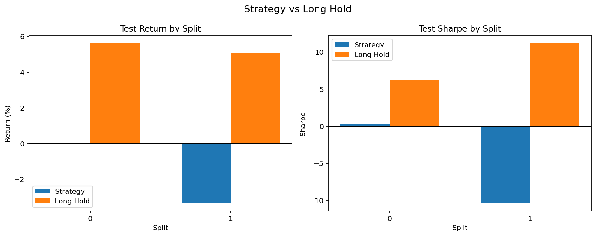
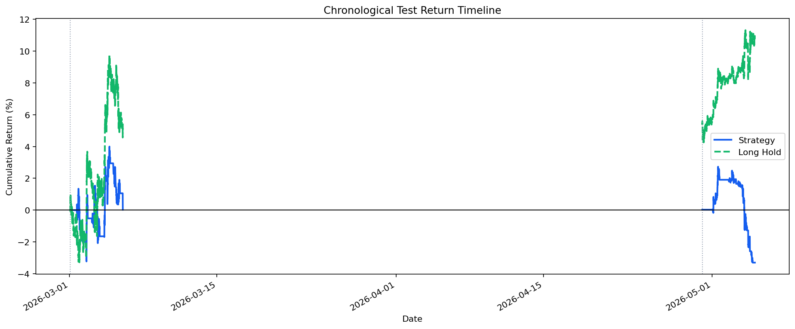
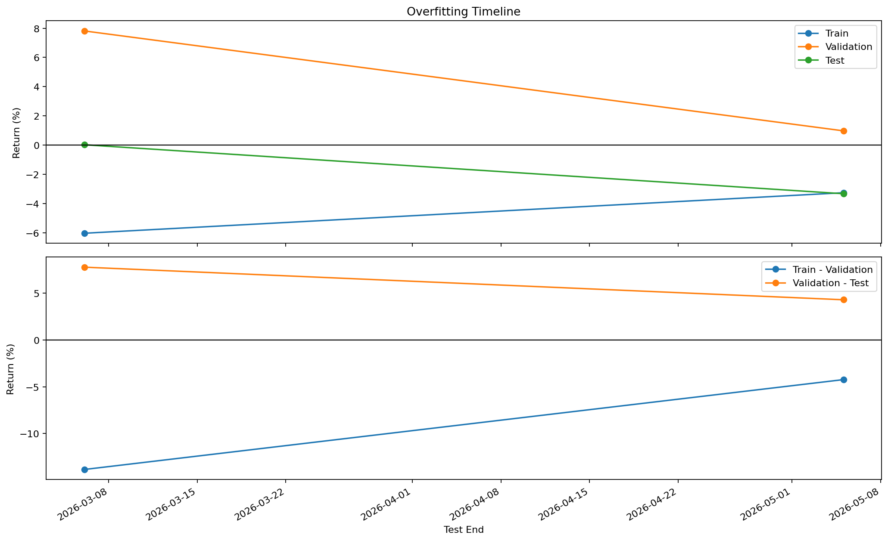

# 전략 백테스트 요약

- 판정: 실패
- 실행 폴더: examples/hyperagent_vbt_smoke2/BTC_USDT_USDT_20260505_104422/gen_0002/full_runs/BTC_USDT_USDT_20260505_104525
- 데이터 설정: CCXT, 거래소 binanceusdm, USDT-M perpetual futures, BTC/USDT:USDT, 5m, 기간 90d, 실제 범위 2026-02-04 01:45:00+00:00 ~ 2026-05-05 01:40:00+00:00
- 워크포워드 설정: train 5760 bars / validation 1440 bars / test 1440 bars, split 2개
- 전략 설정: family `channel_breakout_ls`, 방향 `both`, 선택 기준 `총수익률`, 후보 8개, 최소 거래 1회
- 탐색 공간: window `None` / search space `{'breakout_window': [24, 48, 96, 144], 'exit_window': [6, 12, 24, 48]}`
- 비용 가정: maker 수수료 0.015%, funding/slippage/leverage는 별도 모델링하지 않았습니다.
- 핵심 지표: 테스트 중앙값 -0.016, 플러스 비율 50.0%, Long Hold 초과 비율 0.0%
- 보조 지표: 평균 테스트 수익률 -1.65%, 평균 Long Hold 수익률 5.32%, 평균 테스트 낙폭 5.19%
- 선택된 후보: ['channel_breakout_ls: breakout_window=144, exit_window=24', 'channel_breakout_ls: breakout_window=144, exit_window=48']
- 해석: 선택된 테스트 구간을 시간순으로 이어 보면 전략 누적 수익률이 -3.30%로 홀드 10.92%보다 낮았습니다.
- 해석: train, validation, test 간 점수 격차가 아주 일방적으로 벌어지지는 않아, 오버피팅 양상은 상대적으로 약한 편입니다.
- 실패/판정 이유: 테스트 총수익률 중앙값이 -0.016로 기준 0.000보다 낮았습니다.
- 실패/판정 이유: 홀드를 이긴 비율이 0.0%로 기준 50.0%보다 낮았습니다.
- 실패/판정 이유: 평균 테스트 수익률이 -1.65%로 기준 0.00%보다 낮았습니다.

## 시각화

### 홀드 비교

### 수익률 타임라인

### 오버피팅 타임라인

